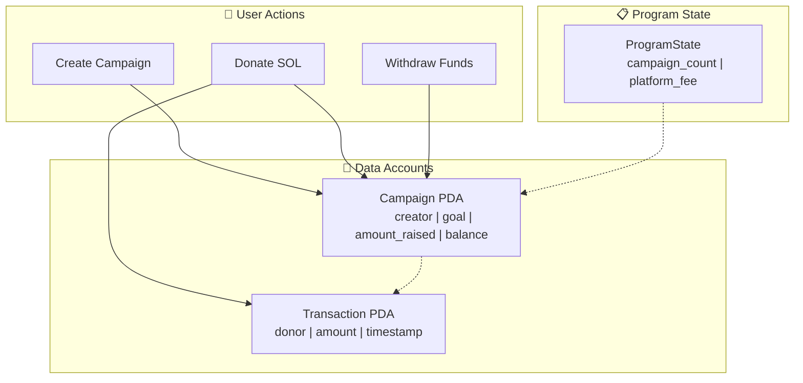

# 🚀 Turbin3 Q4 2025 Builder Cohort

A comprehensive collection of Solana blockchain projects built during the Turbin3 Q4 2025 cohort. This repository showcases expertise in Solana development, smart contract programming with Anchor, and full-stack dApp development.

[](https://solana.com/)
[](https://www.anchor-lang.com/)
[](https://www.typescriptlang.org/)
[](https://www.rust-lang.org/)

## 📚 Table of Contents

- [Overview](#-overview)
- [Projects](#-projects)
- [Prerequisites](#-prerequisites)
- [Getting Started](#-getting-started)
- [Tech Stack](#-tech-stack)
- [Contributing](#-contributing)
- [License](#-license)

---

## 🌟 Overview

This repository contains advanced Solana blockchain projects developed as part of the Turbin3 Builder Cohort Q4 2025. Each project demonstrates different aspects of Solana development, from DeFi protocols to NFT utilities and gaming mechanics.

**Key Learning Outcomes:**
- ✅ Solana Program Development with Anchor Framework
- ✅ PDA (Program Derived Addresses) Management
- ✅ CPI (Cross-Program Invocation) Patterns
- ✅ Token Management (SPL Tokens, NFTs)
- ✅ Full-stack dApp Development
- ✅ Smart Contract Security Best Practices

---

## 🎯 Projects

| Project | Description | Tech | Repository Link |
|---------|-------------|------|-----------------|
| 🌍 **TerraFund** (Capstone) | Decentralized crowdfunding platform with transparent fundraising campaigns | Anchor, Next.js, TypeScript | [📂 View Project](./capstone/terra-fund) |
| 💱 **AMM** | Automated Market Maker implementing x*y=k constant product formula | Anchor, Rust | [📂 View Project](./anchor-amm-starter-q4-25) |
| 🎲 **Dice Game** | On-chain dice game with provably fair randomness using Ed25519 | Anchor, Rust | [📂 View Project](./anchor-dice-game-q4-25) |
| 🤝 **Escrow Program** | Trustless P2P token swap escrow system | Anchor, Rust | [📂 View Project](./anchor-escrow-starter-q4-25) |
| 🎨 **Metaplex Core NFT** | NFT minting and management with Metaplex Core | Anchor, Metaplex | [📂 View Project](./anchor-mplxcore-starter-q4-25) |
| 🔒 **NFT Staking** | Stake NFTs and earn reward tokens over time | Anchor, Rust | [📂 View Project](./anchor-nft-staking-starter-q4-25) |
| 🏦 **Vault Program** | Secure SOL vault with deposit/withdraw functionality | Anchor, Rust | [📂 View Project](./anchor-vault-starter-q4-25) |
| 📝 **Prerequisites** | Initial Turbin3 TypeScript setup and prerequisites | TypeScript | [📂 View Project](./preReq/turbin3_ts) |
| 🎬 **Starter** | Turbin3 starter code and examples | TypeScript, Rust | [📂 View Project](./turbin3_starter) |

---

### 🌍 Capstone: TerraFund

**A decentralized crowdfunding platform built on Solana**

Enables transparent and secure fundraising campaigns with smart contract automation, featuring real-time tracking, secure withdrawals, and platform fee management.

**Key Features:**
- 🚀 Decentralized campaign creation and management
- 💰 Transparent on-chain donation tracking
- 🔒 Smart contract-enforced withdrawal rules (minimum 1 SOL)
- 📊 Real-time campaign progress monitoring
- 🎯 Configurable platform fees (default 7%)
- ⚡ Fast transactions with low costs on Solana

**Tech Stack:**
- **Smart Contracts:** Anchor Framework (Rust)
- **Frontend:** Next.js 14, React, TypeScript
- **Styling:** Tailwind CSS
- **State Management:** Redux Toolkit
- **Wallet:** Solana Wallet Adapter

**Architecture:**


📂 **[View Full Documentation →](./capstone/terra-fund/README.md)**

---

### 💱 AMM (Automated Market Maker)

**Constant product AMM implementing x*y=k formula**

A decentralized exchange protocol allowing users to provide liquidity, swap tokens, and earn fees.

**Key Features:**
- Liquidity pool initialization with dual tokens
- Add/remove liquidity with LP token minting/burning
- Token swaps with configurable fee structure
- Slippage protection mechanisms
- Authority-controlled pool locking

**Smart Contract Highlights:**
- Uses `constant-product-curve` library for calculations
- PDA-based vault accounts for token storage
- LP token minting for liquidity providers
- Fee distribution to liquidity providers

📂 **[View Project →](./anchor-amm-starter-q4-25)**

---

### 🎲 Dice Game

**On-chain dice game with provably fair randomness**

Implements a betting system where players can place bets on dice rolls with verifiable randomness using Ed25519 signatures.

**Key Features:**
- Place bets with customizable roll predictions (2-96)
- Provably fair randomness using Ed25519 signatures
- House edge mechanism (1.5%)
- Automatic payout calculation
- Refund system for expired bets
- Timeout protection (1000 slots)

**Security:**
- Ed25519 signature verification for randomness
- House-signed message validation
- Time-based bet expiry
- Secure vault management

📂 **[View Project →](./anchor-dice-game-q4-25)**

---

### 🤝 Escrow Program

**Trustless token swap escrow system**

Enables peer-to-peer token swaps without requiring trust between parties, with full refund capabilities.

**Key Features:**
- Maker initiates escrow with token A deposit
- Taker completes swap by providing token B
- Maker can refund if deal expires
- Supports SPL tokens and Token-2022
- Atomic swap execution
- PDA-based vault security

**Use Cases:**
- OTC (Over-The-Counter) trades
- NFT-for-token swaps
- P2P trading without centralized exchange

📂 **[View Project →](./anchor-escrow-starter-q4-25)** | **[Documentation →](./anchor-escrow-starter-q4-25/README.md)**

---

### 🎨 Metaplex Core NFT

**NFT minting and management with Metaplex Core**

Implements creator whitelisting, collection management, and NFT minting with plugins.

**Key Features:**
- Creator whitelist management (program authority controlled)
- Collection creation with update authority
- NFT minting with attributes plugin
- Freeze/thaw delegate functionality
- Burn delegate implementation
- On-chain metadata storage

**Advanced Features:**
- Plugin-based attribute system
- Timestamp tracking
- Creator/Minter attribution
- Collection-based organization

📂 **[View Project →](./anchor-mplxcore-starter-q4-25)**

---

### 🔒 NFT Staking

**Stake NFTs and earn reward tokens**

A comprehensive NFT staking system with reward token distribution and freeze delegate mechanics.

**Key Features:**
- Collection-based NFT creation
- NFT staking with freeze delegate
- Points accumulation over time
- Reward token minting and claiming
- Configurable staking parameters
- Freeze period enforcement
- User-specific staking accounts

**Architecture:**
- Config account for global settings
- User accounts tracking points and stakes
- Stake accounts per NFT
- Reward mint for token distribution

📂 **[View Project →](./anchor-nft-staking-starter-q4-25)**

---

### 🏦 Vault Program

**Secure SOL vault with deposit/withdraw functionality**

A simple yet secure vault implementation demonstrating PDA patterns and rent-exempt account management.

**Key Features:**
- Initialize personal vault with rent-exempt balance
- Deposit SOL into vault
- Withdraw SOL from vault
- Close vault and recover all funds
- PDA-based security model

**Learning Objectives:**
- PDA derivation and signing
- Rent-exempt balance management
- CPI with signer seeds
- Account closure patterns

📂 **[View Project →](./anchor-vault-starter-q4-25)** | **[Documentation →](./anchor-vault-starter-q4-25/README.md)**

---

## 📋 Prerequisites

### Required Tools

| Tool | Version | Installation |
|------|---------|--------------|
| Node.js | v18.18.0+ | [Download](https://nodejs.org/) |
| Rust | v1.89.0+ | [Install](https://rustup.rs/) |
| Anchor CLI | v0.32.1+ | `cargo install --git https://github.com/coral-xyz/anchor avm --locked --force` |
| Solana CLI | v1.18.17+ | [Install](https://docs.solana.com/cli/install-solana-cli-tools) |
| Yarn/pnpm | Latest | `npm install -g yarn pnpm` |

### Optional Tools
- [Surfpool](https://surfpool.run/) - Enhanced local testing and runbooks
- [Txtx](https://txtx.sh/) - Infrastructure as Code for Solana

---

## 🚀 Getting Started

### Clone the Repository

```bash
git clone https://github.com/Subodhkd001/Q4_25_Builder_Subodhkd001.git
cd Q4_25_Builder_Subodhkd001
```

### Set Up Solana Wallet

```bash
# Generate new keypair (if needed)
solana-keygen new

# Configure for devnet
solana config set --url devnet

# Get devnet SOL
solana airdrop 2
```

### Working with Projects

Each project has its own setup. Navigate to the project directory:

```bash
# Example: Building the AMM project
cd anchor-amm-starter-q4-25
anchor build
anchor test

# Example: Running TerraFund (Capstone)
cd capstone/terra-fund
pnpm install
pnpm anchor-build
pnpm anchor deploy --provider.cluster devnet
pnpm dev
```

### Using Surfpool (Optional)

Many projects include Surfpool runbooks for deployment:

```bash
# Start local Surfnet
surfpool start

# List available runbooks
surfpool ls

# Execute deployment runbook
surfpool run deployment
```

---

## 🛠️ Tech Stack

### Blockchain & Smart Contracts
- **Solana** - High-performance blockchain
- **Anchor Framework** - Rust framework for Solana programs
- **SPL Token** - Token standard implementation
- **Metaplex** - NFT standard and tools

### Frontend Development
- **React/Next.js** - UI framework
- **TypeScript** - Type-safe JavaScript
- **Tailwind CSS** - Utility-first CSS
- **Solana Wallet Adapter** - Wallet integration
- **Redux Toolkit** - State management

### Development Tools
- **Anchor CLI** - Program development toolkit
- **Solana CLI** - Command-line tools
- **Surfpool** - Local validator and runbooks
- **Jest** - Testing framework

---

## 📖 Learning Resources

### Official Documentation
- [Solana Docs](https://docs.solana.com/)
- [Anchor Book](https://book.anchor-lang.com/)
- [Solana Cookbook](https://solanacookbook.com/)
- [Metaplex Docs](https://developers.metaplex.com/)

### Turbin3 Resources
- [Turbin3 Website](https://turbin3.com/)
- [Discord Community](https://discord.gg/turbin3)

---

## 🤝 Contributing

Contributions, issues, and feature requests are welcome!

1. Fork the repository
2. Create your feature branch (`git checkout -b feature/AmazingFeature`)
3. Commit your changes (`git commit -m 'Add some AmazingFeature'`)
4. Push to the branch (`git push origin feature/AmazingFeature`)
5. Open a Pull Request
